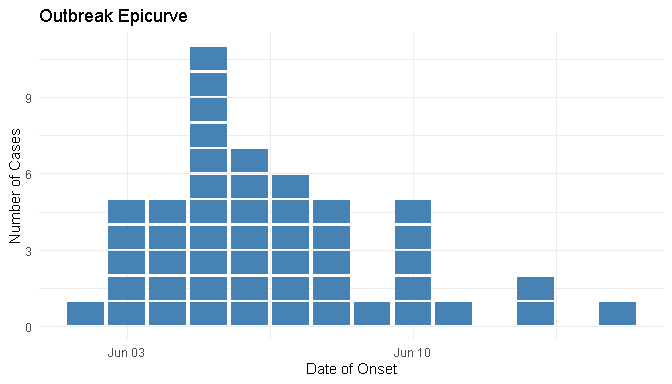
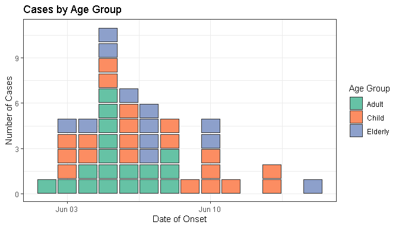
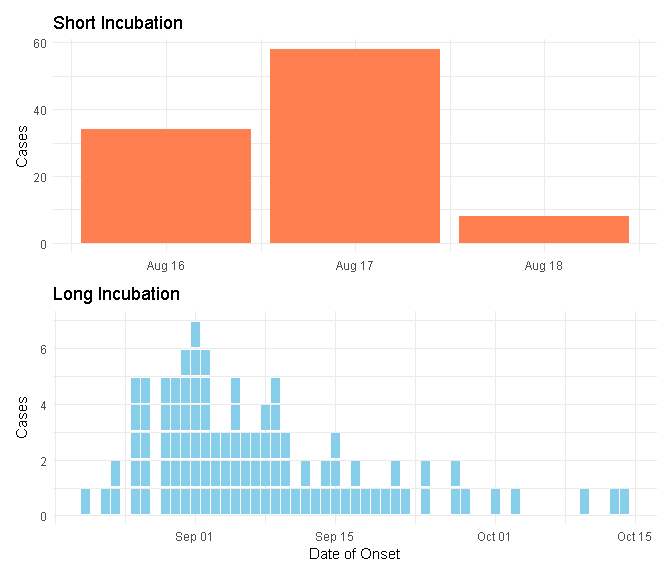
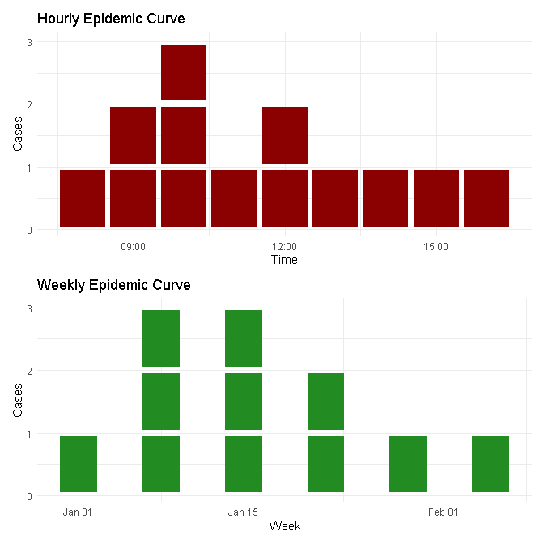
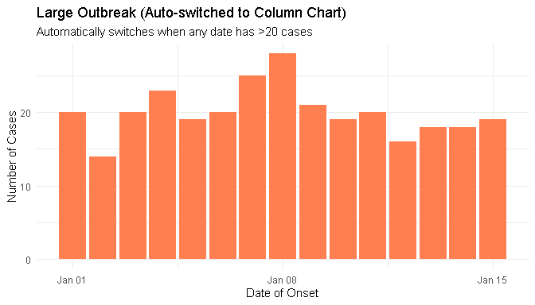
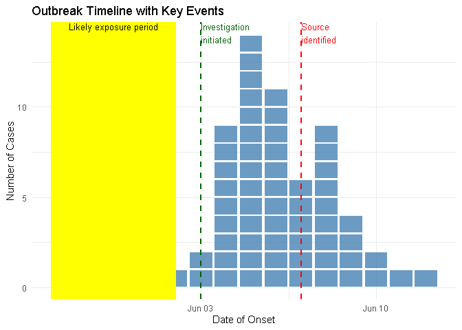
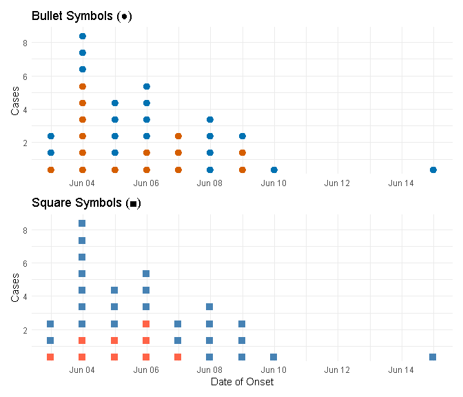
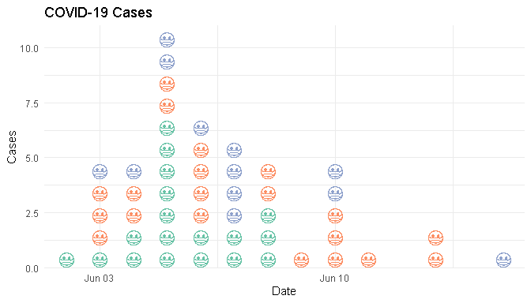
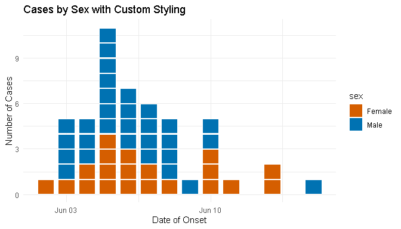

<!-- README.md is generated from README.Rmd. Please edit that file -->

<!-- Test: workflow should regenerate this -->

# paulmisc

<!-- badges: start -->

[](https://github.com/prcleary/paulmisc/actions/workflows/R-CMD-check.yaml)
[](https://app.codecov.io/gh/prcleary/paulmisc)
[](https://lifecycle.r-lib.org/articles/stages.html#experimental)
[](https://opensource.org/licenses/MIT)
<!-- badges: end -->

> Collection of miscellaneous R functions of interest only to Paul

This package provides tools for epidemiological visualisation, data
simulation, and an interactive Shiny app for building SQL queries for
Amazon Redshift.

**Documentation:** <https://prcleary.github.io/paulmisc/>

## Installation

### System Dependencies (Linux)

On Linux, you may need to install system libraries required by ggplot2
and other dependencies:

**Debian/Ubuntu:**

``` bash
sudo apt-get install -y \
  libcurl4-openssl-dev \
  libssl-dev \
  libxml2-dev \
  libfontconfig1-dev \
  libharfbuzz-dev \
  libfribidi-dev \
  libfreetype6-dev \
  libpng-dev \
  libtiff5-dev \
  libjpeg-dev
```

**RHEL/Fedora/Rocky Linux:**

``` bash
sudo dnf install -y \
  libcurl-devel \
  openssl-devel \
  libxml2-devel \
  fontconfig-devel \
  harfbuzz-devel \
  fribidi-devel \
  freetype-devel \
  libpng-devel \
  libtiff-devel \
  libjpeg-turbo-devel
```

### R Package Installation

Install the development version from GitHub:

``` r
# Install remotes if you don't have it
# install.packages("remotes")

remotes::install_github('prcleary/paulmisc')
```

## Features

### Epidemiological Tools

- **`geom_epicurve()`** - A flexible ggplot2 geom for creating classical
  epidemic curves where each case is represented as a small square.
  Features include:
  - **Time period flexibility**: Automatically handles hourly, daily,
    weekly, or monthly data
  - **Automatic column charts**: Switches to column chart mode for large
    outbreaks (configurable threshold)
  - **Custom symbols**: Use Unicode symbols or emoji instead of squares
  - **Full ggplot2 integration**: Works with all scales, themes, facets,
    and aesthetics
  - **Interactive plotly support**: Convert to interactive plots with
    custom tooltips
- **`annotate_event()`** - Add vertical lines to mark specific events
  (e.g., interventions, exposures)
- **`annotate_period()`** - Shade time periods (e.g., exposure windows,
  investigation phases)
- **`simulate_outbreak()`** - Generate realistic outbreak data with
  configurable incubation periods

### Shiny Applications

- **`run_redshift_query_builder()`** - Interactive Shiny app for
  building Amazon Redshift SQL queries without writing code. Features
  include:
  - Form-based query construction
  - Support for WHERE conditions, date filters, aggregates, GROUP BY,
    ORDER BY
  - Real-time validation and error checking
  - One-click copy to clipboard
  - Dark-themed, modern UI

## Usage

### Epidemiological Visualisation

``` r
library(paulmisc)
library(ggplot2)
```

### Basic Epidemic Curve

Create a simple epidemic curve from simulated outbreak data:

``` r
# Simulate a point-source outbreak
cases <- simulate_outbreak(n = 50, seed = 42)

# Create basic epicurve
ggplot(cases, aes(x = onset_date)) +
  geom_epicurve(fill = "steelblue") +
  labs(
    title = "Outbreak Epicurve",
    x = "Date of Onset",
    y = "Number of Cases"
  ) +
  theme_minimal()
```



### Coloured by Category

Visualise cases by demographic or clinical characteristics:

``` r
# Colour by age group
ggplot(cases, aes(x = onset_date, fill = age_group)) +
  geom_epicurve(colour = "grey20") +
  scale_fill_brewer(palette = "Set2") +
  labs(
    title = "Cases by Age Group",
    x = "Date of Onset",
    y = "Number of Cases",
    fill = "Age Group"
  ) +
  theme_bw()
```



### Faceted Analysis

Compare outbreaks across different settings or groups:

``` r
# Facet by setting and colour by outcome
ggplot(cases, aes(x = onset_date, fill = outcome)) +
  geom_epicurve(height = 0.85) +
  facet_wrap(~ setting, ncol = 1, scales = "free_y") +
  scale_fill_manual(
    values = c("Recovered" = "steelblue", "Hospitalised" = "tomato")
  ) +
  labs(
    title = "Outbreak Comparison by Setting",
    x = "Date of Onset",
    y = "Number of Cases",
    fill = "Outcome"
  ) +
  theme_minimal()
```


### Custom Incubation Periods

Simulate outbreaks with different epidemiological characteristics by
adjusting the incubation period parameters. The `meanlog` parameter
controls the median incubation period (median = `exp(meanlog)` days),
while `sdlog` controls the spread around that median:

``` r
# Short incubation period (e.g., Salmonella, norovirus)
# Median incubation: exp(0.5) ≈ 1.6 days
short_incubation <- simulate_outbreak(
  n = 100,
  exposure = as.Date("2024-08-15"),
  meanlog = 0.5,
  sdlog = 0.3,
  seed = 123
)

# Long incubation period (e.g., Hepatitis A)
# Median incubation: exp(3) ≈ 20 days
long_incubation <- simulate_outbreak(
  n = 100,
  exposure = as.Date("2024-08-15"),
  meanlog = 3,
  sdlog = 0.5,
  seed = 123
)

# Compare side by side
library(patchwork)

p1 <- ggplot(short_incubation, aes(x = onset_date)) +
  geom_epicurve(fill = "coral") +
  labs(title = "Short Incubation", x = NULL, y = "Cases") +
  theme_minimal()

p2 <- ggplot(long_incubation, aes(x = onset_date)) +
  geom_epicurve(fill = "skyblue") +
  labs(title = "Long Incubation", x = "Date of Onset", y = "Cases") +
  theme_minimal()

p1 / p2
```



### Different Time Periods

Epidemic curves automatically adapt to hourly, daily, weekly, or monthly
data:

``` r
# Hourly data for rapid outbreak investigation
hourly_cases <- data.frame(
  onset_time = as.POSIXct("2024-06-01 08:00:00") + 
    3600 * c(0, 1, 1, 2, 2, 2, 3, 4, 4, 5, 6, 7, 8)
)

p1 <- ggplot(hourly_cases, aes(x = onset_time)) +
  geom_epicurve(fill = "darkred") +
  labs(title = "Hourly Epidemic Curve", x = "Time", y = "Cases") +
  theme_minimal()

# Weekly aggregated data for surveillance
weekly_cases <- data.frame(
  epi_week = as.Date("2024-01-01") + 7 * c(0, 1, 1, 1, 2, 2, 2, 3, 3, 4, 5)
)

p2 <- ggplot(weekly_cases, aes(x = epi_week)) +
  geom_epicurve(fill = "forestgreen") +
  labs(title = "Weekly Epidemic Curve", x = "Week", y = "Cases") +
  theme_minimal()

p1 / p2
```



The width parameter automatically adjusts based on the time unit
detected.

### Automatic Column Charts for Large Outbreaks

When case counts exceed a threshold (default 20), the plot automatically
switches to a column chart for better readability:

``` r
# Simulate a large outbreak
large_outbreak <- data.frame(
  onset_date = as.Date("2024-01-01") + sample(0:14, 300, replace = TRUE)
)

ggplot(large_outbreak, aes(x = onset_date)) +
  geom_epicurve(fill = "coral", max_stack = 20) +
  labs(
    title = "Large Outbreak (Auto-switched to Column Chart)",
    subtitle = "Automatically switches when any date has >20 cases",
    x = "Date of Onset",
    y = "Number of Cases"
  ) +
  theme_minimal()
```



Control the threshold with `max_stack` parameter, or set
`max_stack = NULL` to always show individual case squares.

### Annotating Outbreak Timelines

Add context to epidemic curves with event markers and period shading:

``` r
# Create an outbreak timeline
outbreak_cases <- simulate_outbreak(n = 60, seed = 789)

ggplot(outbreak_cases, aes(x = onset_date)) +
  geom_epicurve(fill = "steelblue", alpha = 0.8) +
  # Shade the likely exposure period
  annotate_period(
    date = as.Date("2024-05-28"),
    end_date = as.Date("2024-06-02"),
    label = "Likely exposure period",
    fill = "yellow",
    alpha = 0.25
  ) +
  # Mark when investigation started
  annotate_event(
    date = as.Date("2024-06-03"),
    label = "Investigation\ninitiated",
    colour = "darkgreen"
  ) +
  # Mark when source was identified
  annotate_event(
    date = as.Date("2024-06-07"),
    label = "Source\nidentified",
    colour = "red"
  ) +
  labs(
    title = "Outbreak Timeline with Key Events",
    x = "Date of Onset",
    y = "Number of Cases"
  ) +
  theme_minimal()
```



### Custom Symbols and Emoji

Replace squares with Unicode symbols or emoji for creative
visualisations:

``` r
# Use different symbols
symbol_cases <- simulate_outbreak(n = 35, seed = 999)

p1 <- ggplot(symbol_cases, aes(x = onset_date, colour = sex)) +
  geom_epicurve(symbol = "●", symbol_size = 6) +
  scale_colour_manual(values = c("Female" = "#D55E00", "Male" = "#0072B2")) +
  labs(title = "Bullet Symbols (●)", x = NULL, y = "Cases") +
  theme_minimal()

p2 <- ggplot(symbol_cases, aes(x = onset_date, colour = outcome)) +
  geom_epicurve(symbol = "■", symbol_size = 5.5) +
  scale_colour_manual(
    values = c("Recovered" = "steelblue", "Hospitalised" = "tomato")
  ) +
  labs(title = "Square Symbols (■)", x = "Date of Onset", y = "Cases") +
  theme_minimal()

p1 / p2
```



Emoji work too (requires appropriate font support):

``` r
# COVID-19 cases with face mask emoji
ggplot(cases, aes(x = onset_date, colour = age_group)) +
  geom_epicurve(symbol = "😷", symbol_size = 6) +
  scale_colour_brewer(palette = "Set2") +
  labs(title = "COVID-19 Cases", x = "Date", y = "Cases") +
  theme_minimal()
```



### Advanced Customisation

Fine-tune the appearance of individual case squares:

``` r
# Adjust spacing and size
ggplot(cases, aes(x = onset_date, fill = sex)) +
  geom_epicurve(
    width = 0.8,   # Horizontal spacing (0-1)
    height = 0.95, # Vertical spacing (0-1, higher = less gap)
    colour = "white",
    linewidth = 0.2
  ) +
  scale_fill_manual(values = c("Male" = "#0072B2", "Female" = "#D55E00")) +
  labs(
    title = "Cases by Sex with Custom Styling",
    x = "Date of Onset",
    y = "Number of Cases"
  ) +
  theme_minimal()
```



### Interactive Plotly Visualisation

Create interactive epidemic curves with custom tooltips using
`plotly::ggplotly()`:

``` r
library(plotly)

# Add custom tooltip text to the data
cases$tooltip <- paste0(
  "Case ID: ", cases$case_id, "<br>",
  "Date: ", cases$onset_date, "<br>",
  "Age: ", cases$age_group, "<br>",
  "Sex: ", cases$sex, "<br>",
  "Setting: ", cases$setting
)

# Create plot with text aesthetic for tooltips
p <- ggplot(cases, aes(x = onset_date, fill = age_group, text = tooltip)) +
  geom_epicurve() +
  scale_fill_brewer(palette = "Set2") +
  labs(
    title = "Interactive Epidemic Curve",
    x = "Date of Onset",
    y = "Number of Cases"
  ) +
  theme_minimal()

# Convert to interactive plotly plot
ggplotly(p, tooltip = "text")
```

Users can hover over individual case squares to see detailed
information.

**See the [Interactive Epidemic Curves with
Plotly](https://prcleary.github.io/paulmisc/articles/interactive-epicurves.html)
article for live interactive examples you can try in your browser!**

### Redshift SQL Query Builder

Launch the interactive Shiny app for building SQL queries:

``` r
# Launch the Redshift SQL Query Builder Shiny app
run_redshift_query_builder()
```

The app provides a user-friendly interface for:

- **Table Selection**: Specify schema, table name, and optional alias
- **Column Selection**: Choose all columns, specific columns with
  DISTINCT, or aggregate functions (COUNT, SUM, AVG, MIN, MAX, COUNT
  DISTINCT)
- **WHERE Conditions**: Add up to 3 conditions with AND/OR logic using
  various operators (=, !=, \>, \<, \>=, \<=, LIKE, ILIKE, IN, NOT IN,
  IS NULL, IS NOT NULL, BETWEEN)
- **Date Filters**: Filter by date ranges, last N days, current
  month/year, or specific dates using Redshift-specific functions like
  DATEADD and TRUNC
- **Sorting & Grouping**: GROUP BY, HAVING, ORDER BY with LIMIT and
  OFFSET
- **Validation**: Real-time error checking with helpful validation
  messages
- **Copy to Clipboard**: One-click copy of the generated SQL query

The app features a modern dark theme and includes helpful Redshift SQL
tips for common functions and patterns.

## Development

### Setup

Clone the repository and install development dependencies:

``` r
# Install development packages
install.packages(c("devtools", "testthat", "roxygen2", "pkgdown"))

# Load the package
library(paulmisc)
```

### Testing

Run the test suite to ensure everything works correctly:

``` r
# Run all tests
devtools::test()

# Run tests with coverage report
covr::package_coverage()
```

### Documentation

Update documentation after modifying roxygen comments:

``` r
# Generate documentation from roxygen comments
devtools::document()

# Preview documentation for a function
?geom_epicurve
```

### Package Checks

Run R CMD check to ensure the package meets CRAN standards:

``` r
# Run comprehensive package checks
devtools::check()

# Check for common issues
goodpractice::gp()
```

### Building the Package

Build and install the package locally:

``` r
# Build source package
devtools::build()

# Install from local source
devtools::install()

# Or load with library
library(paulmisc)
```

### Website

This package uses pkgdown for documentation website generation:

``` r
# Build the website
pkgdown::build_site()

# Preview locally
pkgdown::preview_site()
```

## Contributing

This is a personal utility package, but suggestions and contributions
are welcome through GitHub issues and pull requests.

## License

MIT + file LICENSE
