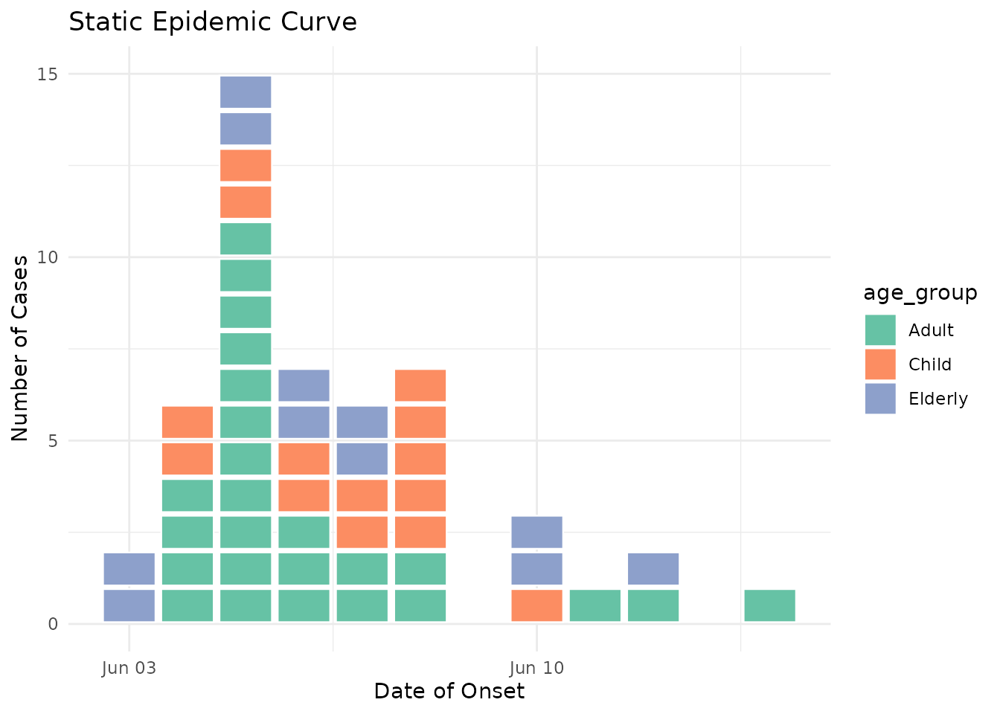

# Interactive Epidemic Curves with Plotly

## Overview

Custom ggplot2 geoms like
[`geom_epicurve()`](https://prcleary.github.io/paulmisc/reference/geom_epicurve.md)
are not directly compatible with
[`ggplotly()`](https://rdrr.io/pkg/plotly/man/ggplotly.html) conversion.
Instead, we can create interactive epidemic curves using plotly’s native
functions. This vignette shows how to build interactive epidemic curves
with custom tooltips using plotly directly.

## Basic Interactive Example

``` r

library(paulmisc)
library(ggplot2)
library(plotly)
#> 
#> Attaching package: 'plotly'
#> The following object is masked from 'package:ggplot2':
#> 
#>     last_plot
#> The following object is masked from 'package:stats':
#> 
#>     filter
#> The following object is masked from 'package:graphics':
#> 
#>     layout

# Generate example outbreak data
cases <- simulate_outbreak(n = 50, seed = 123)
```

First, let’s compute the stacking positions and create a basic
interactive epidemic curve:

``` r

# Compute stacking positions (y values) for each case
cases <- cases[order(cases$onset_date), ]
cases$y <- ave(seq_len(nrow(cases)), cases$onset_date, FUN = seq_along)

# Add custom tooltip text
cases$tooltip <- paste0(
  "Case ID: ", cases$case_id, "<br>",
  "Date: ", cases$onset_date, "<br>",
  "Age: ", cases$age_group, "<br>",
  "Sex: ", cases$sex
)

# Create interactive plotly plot with rectangles
plot_ly(cases) %>%
  add_trace(
    type = "scatter",
    mode = "markers",
    x = ~onset_date,
    y = ~y,
    marker = list(
      symbol = "square",
      size = 20,
      color = "steelblue",
      line = list(color = "white", width = 1)
    ),
    text = ~tooltip,
    hovertemplate = "%{text}<extra></extra>"
  ) %>%
  layout(
    title = "Interactive Epidemic Curve",
    xaxis = list(title = "Date of Onset"),
    yaxis = list(title = "Number of Cases"),
    hovermode = "closest"
  )
```

Hover over any square to see the details for that individual case!

## Interactive by Age Group

Now let’s colour by age group and customise the tooltips further:

``` r

# Enhanced tooltip with more detail
cases$tooltip <- paste0(
  "<b>Case ", cases$case_id, "</b><br>",
  "Date: ", format(cases$onset_date, "%d %B %Y"), "<br>",
  "Age Group: ", cases$age_group, "<br>",
  "Sex: ", cases$sex, "<br>",
  "Setting: ", cases$setting, "<br>",
  "Outcome: ", cases$outcome
)

# Colour palette for age groups
age_colors <- c(
  "0-4" = "#66C2A5",
  "5-17" = "#FC8D62",
  "18-64" = "#8DA0CB",
  "65+" = "#E78AC3"
)

# Create interactive plotly plot coloured by age group
plot_ly(cases) %>%
  add_trace(
    type = "scatter",
    mode = "markers",
    x = ~onset_date,
    y = ~y,
    color = ~age_group,
    colors = age_colors,
    marker = list(
      symbol = "square",
      size = 20,
      line = list(color = "white", width = 1)
    ),
    text = ~tooltip,
    hovertemplate = "%{text}<extra></extra>"
  ) %>%
  layout(
    title = "Interactive Epidemic Curve by Age Group",
    xaxis = list(title = "Date of Onset"),
    yaxis = list(title = "Number of Cases"),
    hovermode = "closest"
  )
#> Warning: Some values were outside the color scale and will be treated as NA
#> Some values were outside the color scale and will be treated as NA
#> Some values were outside the color scale and will be treated as NA
#> Some values were outside the color scale and will be treated as NA
#> Some values were outside the color scale and will be treated as NA
#> Some values were outside the color scale and will be treated as NA
```

## Interactive by Sex

Let’s colour by sex with custom colours:

``` r

# Create interactive plotly plot coloured by sex
plot_ly(cases) %>%
  add_trace(
    type = "scatter",
    mode = "markers",
    x = ~onset_date,
    y = ~y,
    color = ~sex,
    colors = c("Male" = "#0072B2", "Female" = "#D55E00"),
    marker = list(
      symbol = "square",
      size = 20,
      line = list(color = "white", width = 1)
    ),
    text = ~tooltip,
    hovertemplate = "%{text}<extra></extra>"
  ) %>%
  layout(
    title = "Interactive Epidemic Curve by Sex",
    xaxis = list(title = "Date of Onset"),
    yaxis = list(title = "Number of Cases"),
    hovermode = "closest"
  )
```

## Customising Tooltip Content

You have complete control over tooltip content. Here’s an example with
rich HTML formatting:

``` r

# Create highly customised tooltips with HTML formatting
cases$tooltip <- with(cases, paste0(
  "<b style='font-size:14px'>Case ", case_id, "</b><br>",
  "<hr style='margin:2px'>",
  "<i>Date:</i> ", format(onset_date, "%d %B %Y"), "<br>",
  "<i>Demographics:</i> ", age_group, ", ", sex, "<br>",
  "<i>Setting:</i> ", setting, "<br>",
  "<i>Outcome:</i> ", outcome
))

# Colour palette for outcomes
outcome_colors <- c(
  "Recovered" = "#FBB4AE",
  "Hospitalised" = "#B3CDE3",
  "Fatal" = "#CCEBC5"
)

# Create interactive plotly plot coloured by outcome
plot_ly(cases) %>%
  add_trace(
    type = "scatter",
    mode = "markers",
    x = ~onset_date,
    y = ~y,
    color = ~outcome,
    colors = outcome_colors,
    marker = list(
      symbol = "square",
      size = 20,
      line = list(color = "white", width = 1)
    ),
    text = ~tooltip,
    hovertemplate = "%{text}<extra></extra>"
  ) %>%
  layout(
    title = "Interactive Epidemic Curve by Outcome",
    xaxis = list(title = "Date of Onset"),
    yaxis = list(title = "Number of Cases"),
    hovermode = "closest"
  )
```

## Tips for Interactive Visualisation

- **Performance**: Interactive plots with many cases (\>500) may be
  slow. Consider aggregating or filtering for large datasets.
- **Tooltip formatting**: Use HTML tags (`<br>`, `<b>`, `<i>`, `<hr>`)
  for rich formatting in plotly tooltips.
- **Mobile devices**: Interactive features work on touch devices - tap
  to see tooltips.
- **Export**: Use plotly’s built-in export button to save static images
  of your interactive plots.
- **Static plots**: For non-interactive reports, use
  [`geom_epicurve()`](https://prcleary.github.io/paulmisc/reference/geom_epicurve.md)
  with ggplot2 as shown in the main package README.

## Combining with ggplot2

For static (non-interactive) epidemic curves with the authentic “one
square per case” look, use the
[`geom_epicurve()`](https://prcleary.github.io/paulmisc/reference/geom_epicurve.md)
function:

``` r

ggplot(cases, aes(x = onset_date, fill = age_group)) +
  geom_epicurve() +
  scale_fill_brewer(palette = "Set2") +
  labs(
    title = "Static Epidemic Curve",
    x = "Date of Onset",
    y = "Number of Cases"
  ) +
  theme_minimal()
```



The static version using
[`geom_epicurve()`](https://prcleary.github.io/paulmisc/reference/geom_epicurve.md)
provides precise control over spacing and alignment that works perfectly
for printed reports and publications.

## More Information

For more details on plotly customisation, see the [plotly for R
documentation](https://plotly-r.com/).
