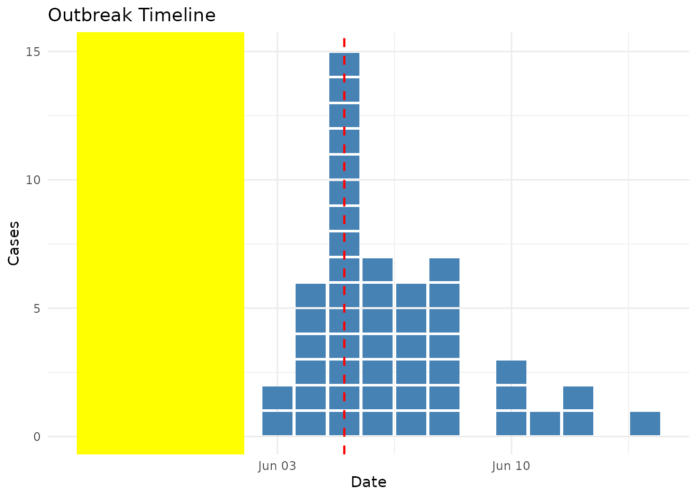

# Interactive Epidemic Curves with Plotly

## Overview

The
[`geom_epicurve()`](https://prcleary.github.io/paulmisc/reference/geom_epicurve.md)
function works seamlessly with [plotly](https://plotly.com/r/) to create
interactive epidemic curves with custom tooltips. This vignette
demonstrates:

- **Basic interactivity**: Converting static plots to interactive
  visualisations
- **Custom tooltips**: HTML-formatted hover information
- **Time periods**: Hourly, daily, and weekly epidemic curves
- **Large outbreaks**: Automatic column chart mode with tooltips
- **Symbols**: Using Unicode symbols and emoji with interactivity
- **Annotations**: Adding timeline context (best for static plots)

Simply create your plot with ggplot2 and convert it using
[`ggplotly()`](https://rdrr.io/pkg/plotly/man/ggplotly.html).

## Basic Interactive Example

``` r

library(paulmisc)
library(ggplot2)
library(plotly)
#> 
#> Attaching package: 'plotly'
#> The following object is masked from 'package:ggplot2':
#> 
#>     last_plot
#> The following object is masked from 'package:stats':
#> 
#>     filter
#> The following object is masked from 'package:graphics':
#> 
#>     layout

# Generate example outbreak data
cases <- simulate_outbreak(n = 50, seed = 123)
```

First, let’s create a basic interactive epidemic curve:

``` r

# Create ggplot with text aesthetic for tooltips
p <- ggplot(cases, aes(x = onset_date, text = format(onset_date, "%d %B %Y"))) +
  geom_epicurve(fill = "steelblue") +
  labs(
    title = "Interactive Epidemic Curve",
    x = "Date of Onset",
    y = "Number of Cases"
  ) +
  theme_minimal()

# Convert to interactive plotly plot
# tooltip = "text" shows only our custom tooltip
ggplotly(p, tooltip = "text")
```

Hover over any square to see its onset date. Each square represents one
case, stacked vertically by date!

## Interactive by Age Group

Now let’s colour by age group and add custom tooltips:

``` r

# Add custom tooltip text (plain text format)
cases$tooltip <- paste0(
  "Case ", cases$case_id, "\n",
  "Date: ", format(cases$onset_date, "%d %B %Y"), "\n",
  "Age Group: ", cases$age_group, "\n",
  "Sex: ", cases$sex, "\n",
  "Setting: ", cases$setting, "\n",
  "Outcome: ", cases$outcome
)

# Create plot with custom tooltips
p <- ggplot(cases, aes(x = onset_date, fill = age_group, text = tooltip)) +
  geom_epicurve() +
  scale_fill_brewer(palette = "Set2", name = "Age Group") +
  labs(
    title = "Interactive Epidemic Curve by Age Group",
    x = "Date of Onset",
    y = "Number of Cases"
  ) +
  theme_minimal()

# Convert to interactive, showing only our custom tooltip
ggplotly(p, tooltip = "text")
```

## Faceted Interactive Plots

Interactive plots work with faceting too:

``` r

p <- ggplot(cases, aes(x = onset_date, fill = sex, text = tooltip)) +
  geom_epicurve() +
  scale_fill_manual(
    values = c("Female" = "#D55E00", "Male" = "#0072B2"),
    name = "Sex"
  ) +
  facet_wrap(~ setting, ncol = 1, scales = "free_y") +
  labs(
    title = "Interactive Epidemic Curves by Setting",
    x = "Date of Onset",
    y = "Number of Cases"
  ) +
  theme_minimal()

ggplotly(p, tooltip = "text")
```

## Customising Tooltip Content

You have complete control over tooltip content. Use HTML formatting for
rich tooltips:

``` r

# Create formatted tooltips with HTML
cases$tooltip <- with(cases, paste0(
  "<b>Case ", case_id, "</b><br>",
  "<b>Date:</b> ", format(onset_date, "%d %B %Y"), "<br>",
  "<b>Demographics:</b> ", age_group, ", ", sex, "<br>",
  "<b>Setting:</b> ", setting, "<br>",
  "<b>Outcome:</b> ", outcome
))

p <- ggplot(cases, aes(x = onset_date, fill = outcome, text = tooltip)) +
  geom_epicurve() +
  scale_fill_brewer(palette = "Pastel1", name = "Outcome") +
  labs(
    title = "Interactive Epidemic Curve by Outcome",
    x = "Date of Onset",
    y = "Number of Cases"
  ) +
  theme_minimal()

ggplotly(p, tooltip = "text")
```

## Interactive Time Period Variants

Epidemic curves work with different time scales - here’s an hourly
outbreak:

``` r

# Create hourly outbreak data
hourly_cases <- data.frame(
  onset_time = as.POSIXct("2024-06-01 08:00:00") + 
    3600 * c(0, 1, 1, 2, 2, 2, 3, 3, 4, 4, 4, 4, 5, 6, 7, 8),
  case_id = 1:16
)

# Add tooltips with formatted time
hourly_cases$tooltip <- paste0(
  "Case ", hourly_cases$case_id, "<br>",
  "Time: ", format(hourly_cases$onset_time, "%d %b %H:%M")
)

p <- ggplot(hourly_cases, aes(x = onset_time, text = tooltip)) +
  geom_epicurve(fill = "darkred") +
  labs(
    title = "Hourly Epidemic Curve (Interactive)",
    x = "Time of Onset",
    y = "Number of Cases"
  ) +
  theme_minimal()

ggplotly(p, tooltip = "text")
```

The width automatically adjusts based on the time unit detected!

## Interactive Large Outbreaks

For large outbreaks, the plot automatically switches to column chart
mode when case counts exceed the threshold:

``` r

# Simulate a large outbreak
set.seed(456)
large_outbreak <- data.frame(
  onset_date = as.Date("2024-01-01") + sample(0:10, 200, replace = TRUE),
  case_id = 1:200
)

# Count cases per date for custom tooltips
date_counts <- aggregate(case_id ~ onset_date, large_outbreak, length)
names(date_counts)[2] <- "count"

# Add tooltip text to each case
large_outbreak <- merge(large_outbreak, date_counts, by = "onset_date")
large_outbreak$tooltip <- with(large_outbreak, paste0(
  "<b>Date:</b> ", format(onset_date, "%d %b %Y"), "<br>",
  "<b>Cases:</b> ", count
))

# Create plot with all cases (geom_epicurve needs one row per case)
p <- ggplot(large_outbreak, aes(x = onset_date, text = tooltip)) +
  geom_epicurve(fill = "coral", max_stack = 20) +
  labs(
    title = "Large Outbreak (Column Chart Mode)",
    subtitle = "Auto-switched because some dates have >20 cases",
    x = "Date of Onset",
    y = "Number of Cases"
  ) +
  theme_minimal()

ggplotly(p, tooltip = "text")
```

## Interactive Symbols

Use custom symbols with interactive tooltips:

``` r

# Create smaller outbreak for symbols
symbol_cases <- simulate_outbreak(n = 30, seed = 789)

# Add detailed tooltips
symbol_cases$tooltip <- with(symbol_cases, paste0(
  "🔴 <b>Case ", case_id, "</b><br>",
  "Date: ", format(onset_date, "%d %B"), "<br>",
  "Age: ", age_group, "<br>",
  "Sex: ", sex
))

p <- ggplot(symbol_cases, aes(x = onset_date, colour = sex, text = tooltip)) +
  geom_epicurve(symbol = "●", symbol_size = 4) +
  scale_colour_manual(
    values = c("Female" = "#D55E00", "Male" = "#0072B2"),
    name = "Sex"
  ) +
  labs(
    title = "Interactive Epidemic Curve with Symbols",
    x = "Date of Onset",
    y = "Number of Cases"
  ) +
  theme_minimal()

ggplotly(p, tooltip = "text")
```

## Timeline Annotations

Add context to your epidemic curves with annotations.

### Static Annotations (for non-interactive plots)

The
[`annotate_event()`](https://prcleary.github.io/paulmisc/reference/annotate_epicurve.md)
and
[`annotate_period()`](https://prcleary.github.io/paulmisc/reference/annotate_epicurve.md)
functions work great for static ggplot outputs:

``` r

# Perfect for static plots
p <- ggplot(cases, aes(x = onset_date)) +
  geom_epicurve(fill = "steelblue") +
  annotate_period(
    date = as.Date("2024-05-28"),
    end_date = as.Date("2024-06-02"),
    label = "Exposure period",
    fill = "yellow",
    alpha = 0.25
  ) +
  annotate_event(
    date = as.Date("2024-06-05"),
    label = "Investigation\nstarted",
    colour = "red"
  ) +
  labs(title = "Outbreak Timeline", x = "Date", y = "Cases") +
  theme_minimal()

print(p)
```



### Interactive Annotations (for plotly)

For interactive plots, use
[`geom_vline()`](https://ggplot2.tidyverse.org/reference/geom_abline.html)
and
[`geom_rect()`](https://ggplot2.tidyverse.org/reference/geom_tile.html)
directly, as these convert better to plotly:

``` r

# Add tooltip data
cases$tooltip <- with(cases, paste0(
  "<b>Case ID:</b> ", case_id, "<br>",
  "<b>Date:</b> ", format(onset_date, "%d %b %Y"), "<br>",
  "<b>Age:</b> ", age_group
))

# Use standard geoms for plotly compatibility
p <- ggplot(cases, aes(x = onset_date, text = tooltip)) +
  # Shaded period (converts to plotly)
  geom_rect(
    aes(xmin = as.Date("2024-05-28"), xmax = as.Date("2024-06-02"),
        ymin = -Inf, ymax = Inf),
    fill = "yellow", alpha = 0.2, inherit.aes = FALSE
  ) +
  # Event markers (convert to plotly)
  geom_vline(
    xintercept = as.Date("2024-06-05"),
    linetype = "dashed", colour = "red", linewidth = 0.75
  ) +
  # The epicurve itself
  geom_epicurve(fill = "steelblue") +
  labs(
    title = "Interactive Outbreak Timeline",
    subtitle = "Hover over cases for details",
    x = "Date", 
    y = "Cases"
  ) +
  theme_minimal()

ggplotly(p, tooltip = "text") %>%
  layout(annotations = list(
    list(x = as.Date("2024-05-30"), y = 1, 
         text = "Exposure period", showarrow = FALSE,
         xref = "x", yref = "paper", yanchor = "bottom"),
    list(x = as.Date("2024-06-05"), y = 0.95,
         text = "Investigation", showarrow = TRUE, 
         ax = 20, ay = -40, arrowcolor = "red",
         xref = "x", yref = "paper")
  ))
```

**Note:** The `layout(annotations = ...)` approach adds text labels
directly in plotly after conversion, giving you full control over
interactive annotation placement.

## Tips for Interactive Visualisation

- **Simple conversion**: Just wrap your ggplot with
  [`ggplotly()`](https://rdrr.io/pkg/plotly/man/ggplotly.html) for basic
  interactivity
- **Custom tooltips**: Add a `text` aesthetic and use
  `ggplotly(p, tooltip = "text")` to show only your custom tooltip
- **Tooltip formatting**: Use `\n` for line breaks in plain text, or use
  HTML tags (e.g., `<br>`, `<b>`) for rich formatting
- **Performance**: Interactive plots with many cases (\>500) may be
  slow. Consider filtering for large datasets
- **Mobile devices**: Interactive features work on touch devices - tap
  to see tooltips
- **Export**: Use plotly’s built-in export button to save static images
- **Styling**: Default plot aesthetics work best - avoid overriding
  fill/colour in geom parameters when using aesthetics

## More Information

For more details on plotly customisation, see the [plotly for R
documentation](https://plotly-r.com/).
