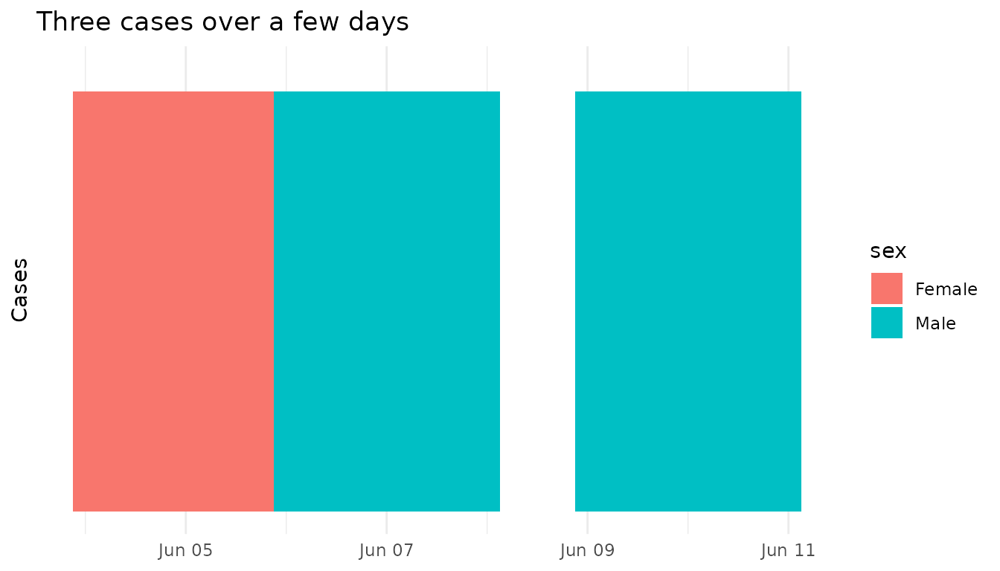
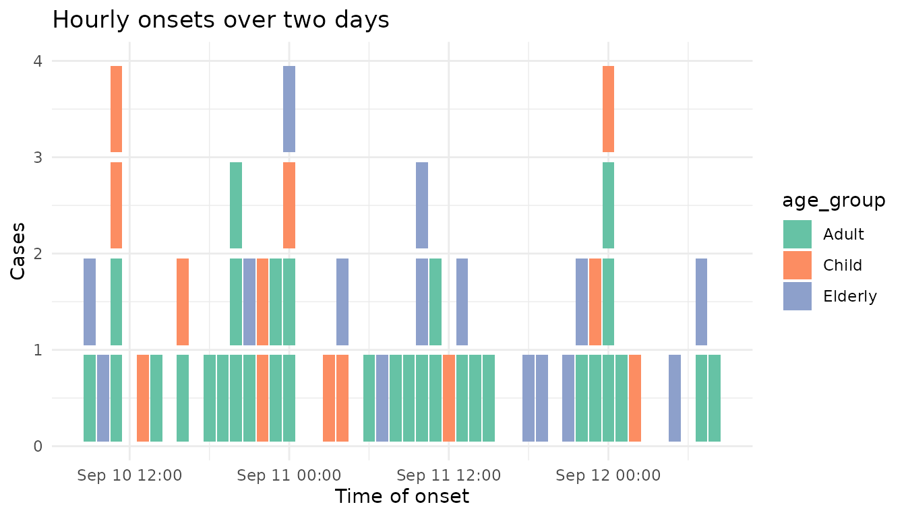
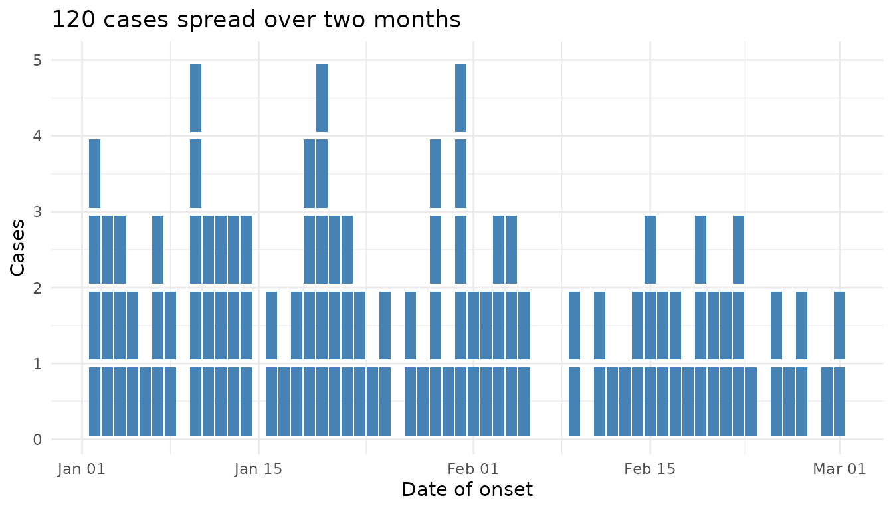
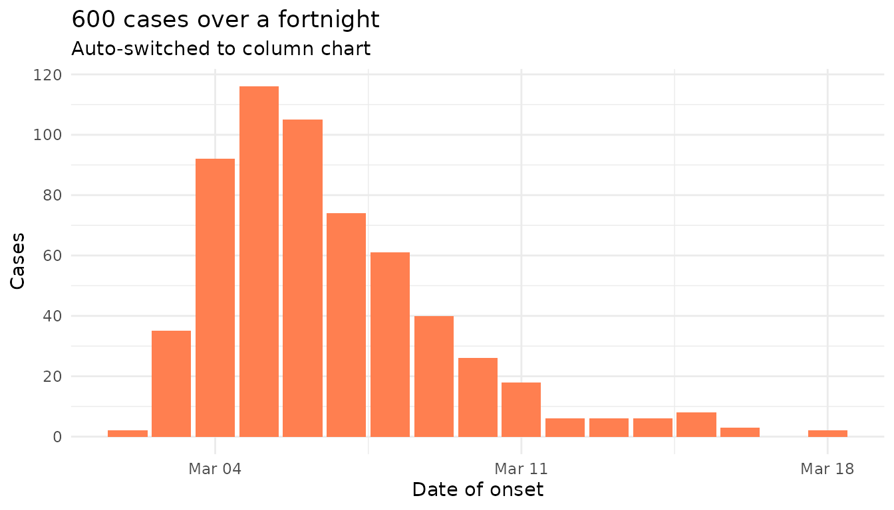
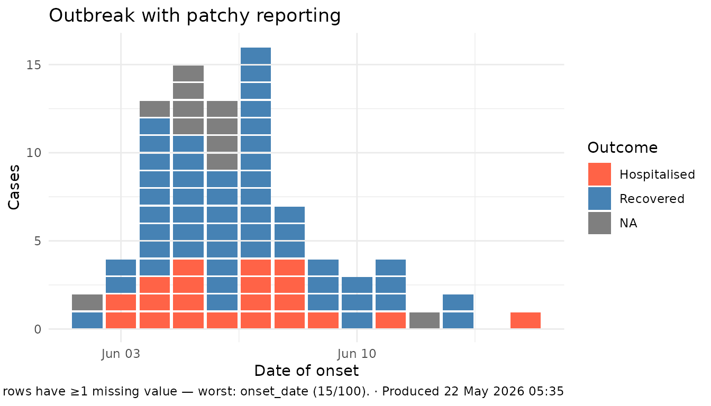
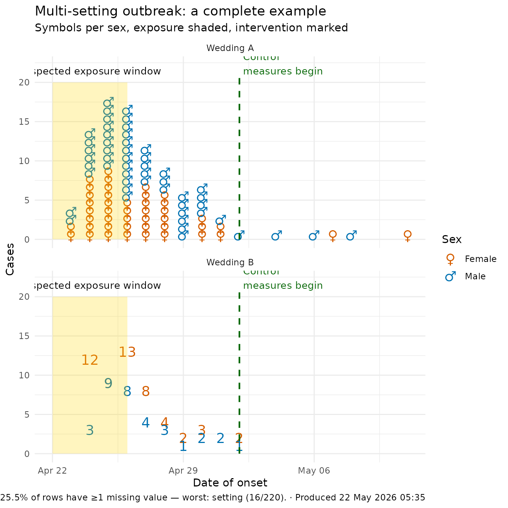

# Realistic and corner-case epicurves

This vignette walks through the kinds of awkward, real-world situations
that an outbreak analyst hits when trying to draw an epicurve: missing
data, very small or very large clusters, very short or very long time
windows, and a final all-in-one example.

## Tiny cluster (n = 3)

``` r

tiny <- simulate_outbreak(n = 3, seed = 42, prop_missing = 0)

ggplot(tiny, aes(x = onset_date, fill = sex)) +
  geom_epicurve() +
  scale_y_epicurve() +
  labs(title = "Three cases over a few days",
       x = NULL, y = "Cases") +
  theme_minimal()
```



## Short window, dense onset (hourly)

``` r

hourly <- simulate_outbreak(
  n = 60,
  time_unit = "hourly",
  pattern = "continuous",
  date_range = 2,
  exposure = "2024-09-10",
  seed = 5,
  prop_missing = 0
)

ggplot(hourly, aes(x = onset_time, fill = age_group)) +
  geom_epicurve() +
  scale_y_epicurve() +
  scale_fill_brewer(palette = "Set2") +
  labs(title = "Hourly onsets over two days",
       x = "Time of onset", y = "Cases") +
  theme_minimal()
```



## Long window, slow burn (60 days)

``` r

long <- simulate_outbreak(
  n = 120,
  pattern = "continuous",
  date_range = 60,
  exposure = "2024-01-01",
  seed = 6,
  prop_missing = 0
)

ggplot(long, aes(x = onset_date)) +
  geom_epicurve(fill = "steelblue") +
  scale_y_epicurve() +
  labs(title = "120 cases spread over two months",
       x = "Date of onset", y = "Cases") +
  theme_minimal()
```



## Large outbreak (auto-switches to column mode)

When stacked squares would exceed `max_stack` on any day, the geom
switches automatically to a column chart so the y-axis stays readable:

``` r

big <- simulate_outbreak(
  n = 600,
  pattern = "point_source",
  date_range = 14,
  exposure = "2024-03-01",
  seed = 7,
  prop_missing = 0
)

ggplot(big, aes(x = onset_date)) +
  geom_epicurve(fill = "coral", max_stack = 20) +
  scale_y_epicurve() +
  labs(title = "600 cases over a fortnight",
       subtitle = "Auto-switched to column chart",
       x = "Date of onset", y = "Cases") +
  theme_minimal()
```



## Missing data, with an automatic footnote

The default
[`simulate_outbreak()`](https://prcleary.github.io/paulmisc/reference/simulate_outbreak.md)
injects a small proportion of missing values.
[`epicurve_footnote()`](https://prcleary.github.io/paulmisc/reference/epicurve_footnote.md)
summarises this and stamps the chart with the run time:

``` r

patchy <- simulate_outbreak(n = 100, seed = 8, prop_missing = 0.12)

ggplot(patchy, aes(x = onset_date, fill = outcome)) +
  geom_epicurve() +
  scale_fill_manual(values = c(Recovered = "steelblue",
                               Hospitalised = "tomato")) +
  scale_y_epicurve() +
  labs(title = "Outbreak with patchy reporting",
       x = "Date of onset", y = "Cases", fill = "Outcome") +
  theme_minimal() +
  epicurve_footnote(patchy)
```



## Everything at once

This last example combines: missing data, faceting by setting,
per-category Unicode symbols (with auto legend), a shaded exposure
window, an event line for control measures, and an automatic footnote.

``` r

outbreak <- simulate_outbreak(
  n = 220,
  exposure = as.Date("2024-04-22"),
  meanlog = 1.4,
  sdlog = 0.55,
  prop_missing = 0.05,
  seed = 11
)

sex_symbols <- c(Female = "\u2640", Male = "\u2642")

# Drop rows with NA in the aesthetics we use (real-life chart prep)
plot_data <- outbreak[!is.na(outbreak$sex) &
                        !is.na(outbreak$setting) &
                        !is.na(outbreak$onset_date), ]

ggplot(plot_data, aes(x = onset_date, colour = sex)) +
  geom_epicurve(symbol = sex_symbols, symbol_size = 5) +
  annotate_period(
    date = as.Date("2024-04-22"),
    end_date = as.Date("2024-04-26"),
    label = "Suspected exposure window",
    fill = "gold", alpha = 0.25
  ) +
  annotate_event(
    date = as.Date("2024-05-02"),
    label = "Control\nmeasures begin",
    colour = "darkgreen"
  ) +
  scale_colour_manual(
    values = c(Female = "#D55E00", Male = "#0072B2"),
    name = "Sex"
  ) +
  facet_wrap(~ setting, ncol = 1, scales = "free_y") +
  scale_y_epicurve() +
  labs(
    title = "Multi-setting outbreak: a complete example",
    subtitle = "Symbols per sex, exposure shaded, intervention marked",
    x = "Date of onset", y = "Cases"
  ) +
  theme_minimal() +
  epicurve_footnote(outbreak)
```


