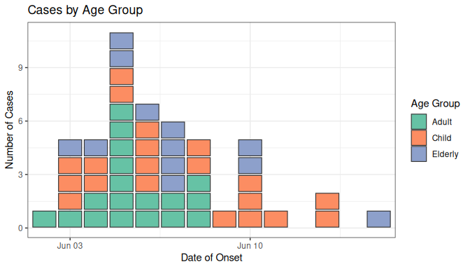
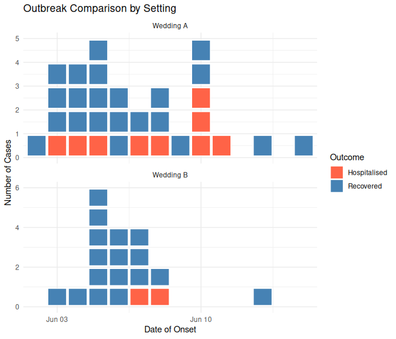

# paulmisc

> Collection of miscellaneous R functions of interest only to Paul

This package provides tools for epidemiological visualization, data
simulation, and an interactive Shiny app for building SQL queries for
Amazon Redshift.

**Documentation:** <https://prcleary.github.io/paulmisc/>

## Installation

Install the development version from GitHub:

``` r

# Install remotes if you don't have it
# install.packages("remotes")

remotes::install_github('prcleary/paulmisc')
```

## Features

### Epidemiological Tools

- **[`geom_epicurve()`](https://prcleary.github.io/paulmisc/reference/geom_epicurve.md)** -
  A ggplot2 geom for creating classical epidemic curves where each case
  is represented as a small square
- **[`simulate_outbreak()`](https://prcleary.github.io/paulmisc/reference/simulate_outbreak.md)** -
  Generate realistic outbreak data for testing and examples

### Shiny Applications

- **[`run_redshift_query_builder()`](https://prcleary.github.io/paulmisc/reference/run_redshift_query_builder.md)** -
  Interactive Shiny app for building Amazon Redshift SQL queries without
  writing code. Features include:
  - Form-based query construction
  - Support for WHERE conditions, date filters, aggregates, GROUP BY,
    ORDER BY
  - Real-time validation and error checking
  - One-click copy to clipboard
  - Dark-themed, modern UI

## Usage

### Epidemiological Visualization

``` r

library(paulmisc)
library(ggplot2)
```

### Basic Epidemic Curve

Create a simple epidemic curve from simulated outbreak data:

``` r

# Simulate a point-source outbreak
cases <- simulate_outbreak(n = 50, seed = 42)

# Create basic epicurve
ggplot(cases, aes(x = onset_date)) +
  geom_epicurve() +
  labs(
    title = "Outbreak Epicurve",
    x = "Date of Onset",
    y = "Number of Cases"
  ) +
  theme_minimal()
```


### Colored by Category

Visualize cases by demographic or clinical characteristics:

``` r

# Color by age group
ggplot(cases, aes(x = onset_date, fill = age_group)) +
  geom_epicurve(colour = "grey20") +
  scale_fill_brewer(palette = "Set2") +
  labs(
    title = "Cases by Age Group",
    x = "Date of Onset",
    y = "Number of Cases",
    fill = "Age Group"
  ) +
  theme_bw()
```



### Faceted Analysis

Compare outbreaks across different settings or groups:

``` r

# Facet by setting and color by outcome
ggplot(cases, aes(x = onset_date, fill = outcome)) +
  geom_epicurve(height = 0.85) +
  facet_wrap(~ setting, ncol = 1, scales = "free_y") +
  scale_fill_manual(
    values = c("Recovered" = "steelblue", "Hospitalised" = "tomato")
  ) +
  labs(
    title = "Outbreak Comparison by Setting",
    x = "Date of Onset",
    y = "Number of Cases",
    fill = "Outcome"
  ) +
  theme_minimal()
```



### Custom Incubation Periods

Simulate outbreaks with different epidemiological characteristics:

``` r

# Short incubation period (e.g., food poisoning)
short_incubation <- simulate_outbreak(
  n = 100,
  exposure = as.Date("2024-08-15"),
  meanlog = 0.5,   # ~1.6 day median
  sdlog = 0.3,
  seed = 123
)

# Long incubation period (e.g., viral hepatitis)
long_incubation <- simulate_outbreak(
  n = 100,
  exposure = as.Date("2024-08-15"),
  meanlog = 3,     # ~20 day median
  sdlog = 0.5,
  seed = 123
)

# Compare side by side
library(patchwork)

p1 <- ggplot(short_incubation, aes(x = onset_date)) +
  geom_epicurve(fill = "coral") +
  labs(title = "Short Incubation", x = NULL, y = "Cases") +
  theme_minimal()

p2 <- ggplot(long_incubation, aes(x = onset_date)) +
  geom_epicurve(fill = "skyblue") +
  labs(title = "Long Incubation", x = "Date of Onset", y = "Cases") +
  theme_minimal()

p1 / p2
```


### Advanced Customization

Fine-tune the appearance of individual case squares:

``` r

# Adjust spacing and size
ggplot(cases, aes(x = onset_date, fill = sex)) +
  geom_epicurve(
    width = 0.8,   # Horizontal spacing (0-1)
    height = 0.95, # Vertical spacing (0-1, higher = less gap)
    colour = "white",
    linewidth = 0.2
  ) +
  scale_fill_viridis_d(option = "plasma", begin = 0.2, end = 0.8) +
  labs(
    title = "Cases by Sex with Custom Styling",
    x = "Date of Onset",
    y = "Number of Cases"
  ) +
  theme_dark()
```


### Redshift SQL Query Builder

Launch the interactive Shiny app for building SQL queries:

``` r

# Launch the Redshift SQL Query Builder Shiny app
run_redshift_query_builder()
```

The app provides a user-friendly interface for:

- **Table Selection**: Specify schema, table name, and optional alias
- **Column Selection**: Choose all columns, specific columns with
  DISTINCT, or aggregate functions (COUNT, SUM, AVG, MIN, MAX, COUNT
  DISTINCT)
- **WHERE Conditions**: Add up to 3 conditions with AND/OR logic using
  various operators (=, !=, \>, \<, \>=, \<=, LIKE, ILIKE, IN, NOT IN,
  IS NULL, IS NOT NULL, BETWEEN)
- **Date Filters**: Filter by date ranges, last N days, current
  month/year, or specific dates using Redshift-specific functions like
  DATEADD and TRUNC
- **Sorting & Grouping**: GROUP BY, HAVING, ORDER BY with LIMIT and
  OFFSET
- **Validation**: Real-time error checking with helpful validation
  messages
- **Copy to Clipboard**: One-click copy of the generated SQL query

The app features a modern dark theme and includes helpful Redshift SQL
tips for common functions and patterns.

## Development

### Setup

Clone the repository and install development dependencies:

``` r

# Install development packages
install.packages(c("devtools", "testthat", "roxygen2", "pkgdown"))

# Load the package
library(paulmisc)
```

### Testing

Run the test suite to ensure everything works correctly:

``` r

# Run all tests
devtools::test()

# Run tests with coverage report
covr::package_coverage()
```

### Documentation

Update documentation after modifying roxygen comments:

``` r

# Generate documentation from roxygen comments
devtools::document()

# Preview documentation for a function
?geom_epicurve
```

### Package Checks

Run R CMD check to ensure the package meets CRAN standards:

``` r

# Run comprehensive package checks
devtools::check()

# Check for common issues
goodpractice::gp()
```

### Building the Package

Build and install the package locally:

``` r

# Build source package
devtools::build()

# Install from local source
devtools::install()

# Or load with library
library(paulmisc)
```

### Website

This package uses pkgdown for documentation website generation:

``` r

# Build the website
pkgdown::build_site()

# Preview locally
pkgdown::preview_site()
```

## Contributing

This is a personal utility package, but suggestions and contributions
are welcome through GitHub issues and pull requests.

## License

MIT + file LICENSE
